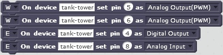
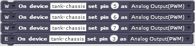
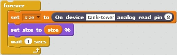
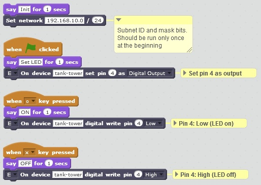
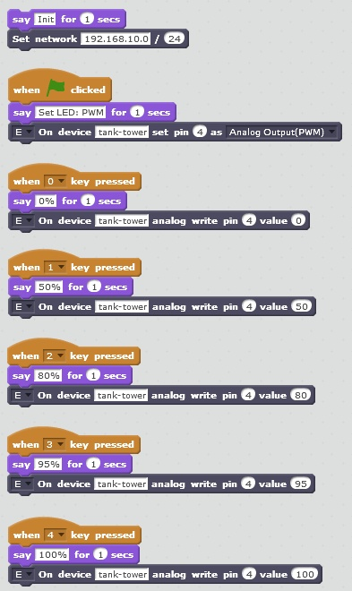

ESP4S2 is a project on ESP8266 NodeMCU with control by MIT Scratch 2 or RoboRemo.
-
  * [Introduction](#introduction)
    * [Feature List](#feature-list)
  * [Installation and Configuration](#installation-and-configuration)
    * [Getting Repository](#getting-repository)
    * [Wiring](#wiring)
    * [NodeMCU Firmware](#nodemcu-firmware)
    * [Controller](#controller)
      * [Socat](#socat)
    * [Bridge](#bridge)
      * [Windows install](#windows-install)
      * [Cygwin install](#cygwin-install)
      * [Linux install](#linux-install)
    * [Scratch](#scratch)
    * [RoboRemo](#roboremo)
      * [Single Controller](#single-controller)
      * [Multiple Controllers](#multiple-controllers)
  * [Programer's Guides](#programers-guides)
    * [Scratch Beginner Programer's Guide](#scratch-beginner-programers-guide)
      * [First steps](#first-steps)
      * [Blocks](#blocks)
      * [LED project](#led-project)
      * [PWM project](#pwm-project)
      * [DC motor project](#dc-motor-project)
    * [Scratch Advanced Programer's Guide](#scratch-advanced-programers-guide)
      * [First steps](#first-steps-1)
      * [Blocks](#blocks-1)
      * [LED project](#led-project-1)
      * [PWM project](#pwm-project-1)
      * [DC motor project](#dc-motor-project-1)
    * [Controller Command Reference](#controller-command-reference)
      * [Get Controller Name](#get-controller-name)
      * [Set Pin Mode](#set-pin-mode)
      * [Digital Read](#digital-read)
      * [Digital Write](#digital-write)
      * [PWM Write](#pwm-write)
      * [PWM Pair Write](#pwm-pair-write)
      * [Tank Write](#tank-write)
      * [Servo Write](#servo-write)
      * [Analog Read](#analog-read)
      * [Poll](#poll)
      * [Reset All](#reset-all)

# Introduction

The aim of this project is giving microcontroller control into hands of kids. The solution is inspired by [A4S](https://github.com/damellis/A4S) and [Firmata](https://github.com/firmata/protocol). Scratch or RoboRemo can be used as user interface. ESP4S2 is licensed under [GPLv3](https://www.gnu.org/licenses/gpl-3.0.html).

ESP8266 is a cheap microcontroller with built-in WiFi (SoC). See [IoT for $10](https://prezi.com/j9xhibnr7qbj/iot-for-10/) to execute a "Hello, World!" example. There are a lot of variants, examples are optimized for [WeMos D1 mini](https://www.wemos.cc/product/d1-mini.html).

Hardware instructions for WeMos D1 mini and tank example are described at [instructables](http://www.instructables.com/id/Controlling-LEGO-Tank-by-ESP8266-With-Scratch-or-R/):


Software Components:
* ESP8266: microcontroller with built-in WiFi _(required)_
  * NodeMCU firmware _(required)_
  * __Controller__, written in Lua for executing control commands and providing sensor values _(required)_
  * H-bridge _(optional)_
  * HC-SR04 _(optional)_
* Scratch 2 Offline Editor: a programming interface _(optional)_
  * __Bridge__, a Scratch Extension written in Python _(required to Scratch)_
  * Python interpreter _(required to Scratch)_
* Roboremo: a simple manual control interface on Android _(optional)_

Example setups:
```
                                                                    +----------+
+-------------------------------------+       +--------------+  +-->| HC-SR04  |
|            Desktop, Laptop          |       |              +--+   +----------+
|                                     |  +--->|  Controller  |
|  +-----------+        +----------+  |  |    |              +--+   +----------+
|  |           |  HTTP  |          +-----+    +--------------+  +-->| H-bridge |
|  |  Scratch  +------->|  Bridge  |  | WiFi                        +----------+
|  |           |        |          +-----+    +--------------+
|  +-----------+        +----------+  |  |    |              |      +----------+
|                                     |  +--->|  Controller  +----->| H-bridge |
|                                     |       |              |      +----------+
+-------------------------------------+       +--------------+


                   +------------------+
                   |  Tablet, Phone   |
                   |                  |                             +----------+
                   |  +------------+  |       +--------------+  +-->| H-bridge |
                   |  |            |  | WiFi  |              +--+   +----------+
                   |  |  RoboRemo  +--------->|  Controller  |
                   |  |            |  |       |              +--+   +----------+
                   |  +------------+  |       +--------------+  +-->| HC-SR04  |
                   |                  |                             +----------+
                   |                  |       
                   +------------------+              


                                                                    +----------+
                   +------------------+       +--------------+  +-->+ HC|SR04  |
                   |  Tablet, Phone   |       |              +--+   +----------+
                   |                  |  +--->+  Controller  |
                   |  +------------+  |  |    |              +--+   +----------+
                   |  |            +-----+    +--------------+  +-->+ H|bridge |
                   |  |  RoboRemo  |  | WiFi                        +----------+
                   |  |            +-----+    +--------------+
                   |  +------------+  |  |    |              |      +----------+
                   |                  |  +--->+  Controller  +----->+ H|bridge |
                   |                  |  UDP  |              |      +----------+
                   +------------------+ broad +--------------+
                                        -cast

```

## Feature List
Supported Scratch commands:
- [x] `Set network` (`initNet`): Initialize WiFi subnet (only one subnet is supported simultaneously), IP address is a sum of subnet address and device id.
- [x] `set pin` (`pinMode`): NodeMCU command(s): `gpio.mode` or `pwm.setup` + `pwm.start`
- [x] `digital write pin` (`digitalWrite`): NodeMCU command(s): `gpio.write`
- [x] `analog write pin` (`analogWrite`): NodeMCU command(s): `pwm.setduty`
- [x] `analog write pin pair` (`analogPairWrite`): NodeMCU command(s): `pwm.setduty`
- [x] `tank write pin pair` (`tankWrite`): NodeMCU command(s): `pwm.setduty`
- [ ] `servo write pair` (`servoWrite`): NodeMCU command(s): `gpio.write`
- [x] `digital read pin` (`digitalRead`): NodeMCU command(s): `gpio.read`
- [x] `analog read pin` (`analogRead`): NodeMCU command(s): `adc.read` or custom sensor command
- [x]  (`reset_all`): Reset state machine, NodeMCU command(s): `gpio.write`, `pwm.setduty`
- [x] (`poll`): return cached values of `digitalRead`, `analogRead`
- [ ] Simplified Block commands

Bridge Features:
- [x] Supporting more NodeMCUs in one WiFi network
- [x] Command-line parameters
- [x] Overload protection by state machine (only changes are sent to Controller)
- [x] Overload protection by UDP "ACK" (waiting for processing the earlier sent command, +timeout)
- [x] Overload protection by batch command sending (programmatically configured)
- [x] Overload protection by rare poll and caching digitalRead/analogRead values
- [ ] Overload protection by queue size limitation (drop) 
- [x] Name resolution (instead of IP address) 
- [ ] Simplified Block commands
- [ ] Unit tests 

Controller Features:
- [x] Basic digital pin handling (mode, high/low, PWM)
- [ ] `analogRead`: `adc.read` registers value to D16 (virtual)
- [x] `analogPairWrite`: transforms a [-100,+100] value to 2 pins of H-bridge for a DC motor 
- [x] `tankWrite`: transforms a joystick XY value pair ([-100,+100], [-100,+100]) to A-B pins of H-bridge for 2 DC motor 
- [x] `getName`: returns Bridge name 
- [ ] Too small PWM value is overwritten to 0 (for DC motors)
- [x] WiFi station and AP mode
- [x] MAC-based configuration
- [x] Configuration for more networks
- [x] State check for pin mode 
- [ ] Automatic pin mode 
- [x] UDP
- [ ] Send values back to RoboRemo
- [ ] TCP
- [x] Supporting more NodeMCUs in one WiFi network, for Bridge
- [x] Supporting more NodeMCUs in one WiFi network, for RoboRemo (UDP broadcast)
- [x] HC-SR04 sensor support
- [ ] DHT sensor support
- [ ] BMP180 sensor support

# Installation and Configuration

## Getting Repository
Clone or download and extract repository from GitHub. Please read [LICENSE](LICENSE).

## Wiring
[WeMos D1 mini](http://www.wemos.cc/Products/d1_mini.html) system has some additional resistors and dedicated pins for shields. These constraints determine a logical pinout:

| ESP-8266 Pin| Pin | WeMos Function | suggested ESP4S2 Function
| --- | --- | ---  | --- 
| A0     | A0 | Analog input, max 3.3V input | Analog input
| GPIO16 | D0 | IO              | HC-SR04 Trig
| GPIO5  | D1 | IO, SCL         | I2C for shields
| GPIO4  | D2 | IO, SDA         | I2C for shields
| GPIO0  | D3 | IO, 10k Pull-up | H-bridge B2
| GPIO2  | D4 | IO, BUILTIN_LED<br/>10k Pull-up | Blue LED<br/>DHT Data
| GPIO14 | D5 | IO, SCK         | H-bridge A1
| GPIO12 | D6 | IO, MISO        | H-bridge A2
| GPIO13 | D7 | IO, MOSI        | H-bridge B1
| GPIO15 | D8 | IO, SS<br/>10k Pull-down | HC-SR04 Echo<br/>+ 4k7: 5V-->3.3V voltage divider

D8 pin works well with Pololu DRV8833 as B2 input, but activates motor B with cheap L9110 at power on. D3 works well with cheap L9110. I2C pins are used by WeMos shields [OLED](http://www.wemos.cc/Products/oled_shield.html) and [Motor](http://www.wemos.cc/Products/motor_shield.html).

HC-SR04 needs 5V power, Echo pin output is 5V, too (3.3V input is good for Trig). A 4k7 with built-in 10k Pull-down resistor behave as a voltage divider, see: [HC-SR04 Ultrasonic Range Sensor on the Raspberry Pi](http://www.modmypi.com/blog/hc-sr04-ultrasonic-range-sensor-on-the-raspberry-pi).

Pin D4 is used by WeMos shields [DHT](http://www.wemos.cc/Products/dht_shield.html) and [DHT Pro](http://www.wemos.cc/Products/dht_pro_shield.html).

Other pinout can also be used.

## NodeMCU Firmware
NodeMCU is an embedded Lua firmware to ESP8266. Firmware can be download from [NodeMCU custom builds](https://nodemcu-build.com/) (builds combined binary). For using H-bridge, PWM module must be selected. For using DHT sensor, DHT module must be selected. Integer build must be used.
Firmware can be flashed by esptool.py or NodeMCU Flasher, see [Flashing the firmware](https://nodemcu.readthedocs.io/en/dev/en/flash/). Since 1.5.1-master, default baud is 115200 (instead of 9600).

## Controller
Copy `secure.lua.example` to `secure.lua` and edit own WiFi authentication configuration.

Copy `config.lua.example` to `config.lua` and edit network configuration. 

* Controller supports more WiFi network configuration, selected by `WIFI_CFG_NAME`. 

* Controllers are identified by its MAC address. STATION and AP mode are supported. In STATION mode (`wifiMode=wifi.STATION`), Controller requests an IP address from a WiFi AP (a WiFi router or an ESP8266 in SOFTAP or STATIONAP mode). If WiFi AP is not alive, `ip` parameter will be used. If `static_ip=true`, Controller enforces `ip` as IP address (`netmask` should be declared, too). In SOFTAP mode (`wifiMode=wifi.SOFTAP`), NodeMCU runs as WiFi AP and WiFi router is not required for WiFi communication. Other Controllers in this WiFi network should be configured with static IP address (`static_ip=true`). 

* The Controller listening port can be set by `ROBOREMO_PORT`, its default value is `9876`. Sensors with custom feature can be configured in `devices`.

[ESPlorer](http://esp8266.ru/esplorer/) can be used to upload Lua files to ESP. Upload all `*.lua` files of directory `lua` to NodeMCU. After reset, NodeMCU will be ready to receive commands and send back input values.

### Socat
`socat` can be used for testing Controller without any GUIs (Scratch, RoboRemo). Socat can be installed on Cygwin and Linux. Anoter famous program, `nc` (Netcat), can also send UDP messages, but cannot send from and receive to same port.

Example for sending commands to a specific IP address (Scratch use case):
``` 
socat readline UDP4-DATAGRAM:192.168.10.102:9876,bind=:9877
getName
pinMode 4 1
digitalWrite 4 0
digitalWrite 4 1
```

Example for sending commands to broadcast address (RoboRemo use case):
``` 
socat readline UDP4-DATAGRAM:192.168.10.255:9876,bind=:9877
getName
tank-tower pinMode 4 1
tank-tower digitalWrite 4 0
tank-tower digitalWrite 4 1
```

There are several online portals, where broadcast address can be calculated, for example: [http://www.subnet-calculator.com/](IP Subnet Calculator). 

## Bridge
Bridge requires Python 2.7. Bridge command line options will be printed out by `--help` parameter. Bridge listening port can be set by `--esp-listen-port`, its default value is `9877`. Controllers port can be set by `--esp-port`, its default value is `9876`.

### Windows install
Python 2.7 can be downloaded and installed from [Python Releases for Windows](https://www.python.org/downloads/windows/). Example for starting Bridge:

`C:\Python27\python.exe -c src\ESP4S2.py`

### Cygwin install
Pyton 2.7 package can be installed to [Cygwin](https://www.cygwin.com/). Example for starting Bridge:

`src/ESP4S2.py`

### Linux install
Pyton 2.7 package installation is described at the Linux distributor. Example for starting Bridge:

`src/ESP4S2.py`

## Scratch
Install [Scratch 2 Offline Editor](https://scratch.mit.edu/scratch2download). Import ESP42S extension description `src/ESP4S2.s2e` (shift-click on "File" and select "Import Experimental Extension" from the menu). The new extension blocks will appear in the More Blocks palette.

## RoboRemo
[RoboRemo](http://www.roboremo.com) can be installed for Android by [Google Play](https://play.google.com/store/apps/details?id=com.hardcodedjoy.roboremo). Commands are described in the chapter [Controller Command Reference](#controller-command-reference).

### Single Controller
To connect RoboRemo to Controller, use "Internet (UDP)" connection. Example for a connection string: `192.168.10.102:9876`, where the ip and port was set up in `lua/config.lua`.  
A button should be created for initialize pins. Example init button configuration for a H-bridged DC motor on pins 5, 6 and a LED on pin 4:
* set press action (`\n` is also supported instead of Enter): 
```
pinMode 4 1
pinMode 5 3
pinMode 6 3
```
* repeat: delay, period = `0`, `only press action`

Example on/off button configuration for a LED on pin 4:
* set press action: `digitalWrite 4 1` or `digitalWrite 4 0`, depending on a pull-up resistor of the pin. 
* repeat: delay, period = `0`, `only press action`

Example slider for a H-bridged DC motor on pins 5, 6:
* set id: `analogPairWrite 5 6`
* set min, max: min = `-100`, max = `100`
* send when released (tricky: `send when move` should be seen)
* set repeat period: `500` ms

### Multiple Controllers
RoboRemo cannot connect to multiple IP addresses. In this case, the boradcast IP address of subnet can be used. For example, if the subnet is 192.168.10.0/24, the broadcast address is 192.168.10.255. There are several online portals, where broadcast address can be calculated, for example: [http://www.subnet-calculator.com/](IP Subnet Calculator). The command sending to this address will be received by all of Controllers. The target Controller name must be marked by the beginning of the command, for example: `tank-tower pinMode 4 1`, `tank-tower digitalWrite 4 0`, `tank-tower digitalWrite 4 1`. Without marking the Controller name, all Controllers will execute the command. 

# Programer's Guides

## Scratch Beginner Programer's Guide

Blocks for full functionality looks too complex for young children. Simplified blocks are created for them in order to have experience on microcontrollers. These Blocks have some limitations, for example:
* Only one Controller is supported.
* Pin groups must be named for group operations (for example: `analogPairWrite`, `tankWrite`).
* Waiting for next command (`W`) is not supported.
With this limitations, each student can handle own named Controller.

### First steps
Coming soon...

### Blocks
Coming soon...

### LED project
Coming soon...

### PWM project
Coming soon...

### DC motor project
Coming soon...

## Scratch Advanced Programer's Guide

### First steps
After starting Bridge (`src/ESP4S2.py`) and loading ESP42S extension description (`src/ESP4S2.s2e`), Scratch is ready to create block programs. The first block which must be executed is the `Set network`. This block initializes Bridge and requests Controllers to send its names back for name resolution. Example for `Set network` block: , where `192.168.10.0` is the subnet ID and `24` is the subnet mask bits. There are several online portals, where subnet ID and subnet mask bits can be calculated, for example: [http://www.subnet-calculator.com/](IP Subnet Calculator). At least one second must be wait to collect responses from Controllers, for example: .

### Blocks
Pin mode must be set before using a pin (`set pin`). A block can be executed immediately (`E`) or with the next (`W`). More blocks can be bundled to one group until the first `E` block. The last block of execution bundle must be `E`. Examples for bundled blocks:
* 
* 

The simplest control block is the `digital write pin`. See examples for controlling WeMos built-in led:
* 
* 

PWM can be controlled by block `analog write pin`, for example: .

H-bridged DC motors can be controlled by `analog write pin pair` block, for example: . The value must be set in interval [-100, 100].

Two H-bridged DC motors can be controlled by `tank write pin quad` block, for example: . Four pins and XY values (joystick) must be set in interval [-100, 100]. Controller transforms XY values to A-B values.

Values can be used by blocks `digital read pin` and `analog read pin`, for example:
* 
* 

### LED project
It's the "Hello, World!" example of microcontroller world. Built-in blue LED of WeMos is connected to pin `4`. Because of built-in pull-up resistor, LED behaves opposite. After starting Controller and Bridge, please create the below project:



Click once on `Set network`. The `192.168.10.0/24` network will be used for communicating to Bridges. It will be valid until Brigde running. Depending on the network setup (WiFi router, ESP AP), the network can be different.

Click on . Block `set pin` will set pin `4` to OUTPUT.

When `o` key pressed, pin 4 will be set Low (`0`). Because of built-in pull-up resistor, LED will be turned on. When `x` key pressed, pin 4 will be set High (`1`). Because of built-in pull-up resistor, LED will be turned off.

Click on  to stop all pins.

### PWM project
This project demonstrates PWM. Because of built-in pull-up resistor on pin `4`, LED behaves opposite: it will ligth strongest by setting PWM duty cycle to 0% and LED will be turned off by setting PWM duty cycle 100%. After starting Controller and Bridge, please create the below project:



Click once on `Set network`. It will be valid until Brigde running.

Click on . Block `set pin` will set pin `4` to PWM.

Press keys 0, 1, 2, 3, 4 to try PWM duty cycles 0%, 50%, 80%, 95%, 100%.

Click on  to stop all pins.

### DC motor project
This project demonstrates DC motor control using PWM and H-bridge. 

## Controller Command Reference

A command can be sent to one Controller or to all Controllers, using broadcast address. In this case, the Controller name must be specified before the command. General syntax of commands is:

```[controller-name ]commandName[ option1[ option2[ option3[...]]]```

Endline (`\n`) is required at the end of command. Controller name can be set in `config.lua`.

### Get Controller Name

Command `getName` returns Controller name. This feature is used for Scratch for name resolution. Practically, it should be sent to broadcast address. Example:

```echo "getName" | socat STDIO UDP4-DATAGRAM:192.168.10.255:9876,bind=:9877```

### Set Pin Mode

Command `pinMode` initializes pin. The below modes are supported:
* `0`: INPUT, called NodeMCU command: `gpio.mode(pin, gpio.INPUT)`
* `1`: OUTPUT, called NodeMCU command: `gpio.mode(pin, gpio.OUTPUT)`
* `2`: Analog input. If pin `0`, `adc.read` will be called later, otherwise, a sensor driver can store integer value on this pin.
* `3`: PWM, called NodeMCU commands: `pwm.setup(pin,1000,0)`, `pwm.start(pin)`
* `4`: Servo, not supported yet.

Command syntax is: `pinMode <pin> <mode>`. Example for set pin `4` mode to OUTPUT using single IP address and broadcast address:

```echo "pinMode 4 1" | socat STDIO UDP4-DATAGRAM:192.168.10.103:9876,bind=:9877```

```echo "tank-chassis pinMode 4 1" | socat STDIO UDP4-DATAGRAM:192.168.10.255:9876,bind=:9877```

### Digital Read

Command `digitalRead` reads digital GPIO pin value. It calls `gpio.read(pin)` and returns by the given level. Before executing this command, pin mode must be set to INPUT. Command syntax is: `digitalRead <pin>`. Example for set pin `3` mode to INPUT and reading pin level:

``` 
socat readline UDP4-DATAGRAM:192.168.10.103:9876,bind=:9877
pinMode 3 0
digitalRead 3
```

### Digital Write

Command `digitalWrite` sets digital GPIO pin value. It calls `gpio.write(pin, level)`. Before executing this command, pin mode must be set to OUTPUT. Command syntax is: `digitalWrite <pin> <level>`. Example for set pin `4` mode to OUTPUT and set its level to gpio.LOW and gpio.HIGH:

``` 
socat readline UDP4-DATAGRAM:192.168.10.103:9876,bind=:9877
pinMode 4 1
digitalWrite 4 0
digitalWrite 4 1
```

### PWM Write

Command `analogWrite` sets duty cycle for a pin, duty interval is [`0`,`100`]. It calls `pwm.setduty(pin, duty)`. Before executing this command, pin mode must be set to PWM. Command syntax is: `analogWrite <pin> <duty>`. Example for set pin `4` mode to PWM and set duty cycle to `50` and `100`:

``` 
socat readline UDP4-DATAGRAM:192.168.10.103:9876,bind=:9877
pinMode 4 3
analogWrite 4 50
analogWrite 4 100
```

### PWM Pair Write

Command `analogPairWrite` sets duty cycle for 2 pins of a H-bridged DC motor, duty interval is [`-100`,`100`]. If the duty is negative, DC motor will turn reverse. In simple case, it calls `pwm.setduty(pin1, duty)` and `pwm.setduty(pin2, 0)`. If the value is negative, the polarity should be changed, so `pwm.setduty(pin1, 0)` and `pwm.setduty(pin2, 0-duty)` will be called. Before executing this command, pin mode must be set to PWM both on 2 pins. Command syntax is: `analogWrite <pin1> <pin2> <duty>`. Example for set pins `5` and `6` mode to PWM and set duty cycle to 50 and -50 (reverse turn):

``` 
socat readline UDP4-DATAGRAM:192.168.10.103:9876,bind=:9877
pinMode 5 3
pinMode 6 3
analogPairWrite 5 6 50
analogPairWrite 5 6 -50
```

### Tank Write

Command `tankWrite` transforms a joystick XY value pair ([-100,+100], [-100,+100]) to A-B pins of H-bridge for 2 DC motor. The command calls `pwm.setduty(pin, duty)` on each 4 pins. Before executing this command, pin mode must be set to PWM both on 4 pins. Command syntax is: `tankWrite <pinA1> <pinA2> <pinB1> <pinB2> <x> <y>`. Example for set pins `5`, `6`, `7`, `3` mode to PWM and set x and y values to drive forward, right and turn left in place:

``` 
socat readline UDP4-DATAGRAM:192.168.10.103:9876,bind=:9877
pinMode 5 3
pinMode 6 3
pinMode 7 3
pinMode 3 3
tankWrite 5 6 7 3 0 100
tankWrite 5 6 7 3 100 100
tankWrite 5 6 7 3 -100 0
```

### Servo Write

Not supported yet.


### Analog Read

Command `analogRead` reads integer values on pins. If pin is `0`, `adc.read(0)` will be called, otherwise, returns sample value of custom sensor driver. Pin mode (`pinMode`) should not called on the pin. Command syntax is: `analogRead <pin>`. Example for getting sensor sample configured on pin `8`:

```echo "analogRead 8" | socat STDIO UDP4-DATAGRAM:192.168.10.255:9876,bind=:9877```

### Poll

Command `poll` returns all cached `digitalRead` and `analogRead` values. Example for getting all cached values:
  
```echo "poll" | socat STDIO UDP4-DATAGRAM:192.168.10.255:9876,bind=:9877```

### Reset All

Command `reset_all` resets output values to `0`. It calls `gpio.write(pin, 0)` on mode OUTPUT and calls `pwm.setduty(pin, 0)` on mode PWM. Example for getting all cached values:
  
```echo "reset_all" | socat STDIO UDP4-DATAGRAM:192.168.10.255:9876,bind=:9877```
