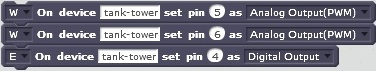

# ESP4S2
ESP8266 NodeMCU for MIT Scratch 2

## Introduction
The aim of this project is giving microcontroller control into hands of kids. The solution is inspired by [A4S](https://github.com/damellis/A4S) and [Firmata](https://github.com/firmata/protocol). Scratch or RoboRemo can be used as user interface. ESP4S2 is licensed under [GPLv3](https://www.gnu.org/licenses/gpl-3.0.html).

ESP8266 is a cheap microcontroller with built-in WiFi (SoC). See [IoT for $10](https://prezi.com/j9xhibnr7qbj/iot-for-10/) to execute a "Hello, World!" example. There are a lot of variants, examples are optimized for [WeMos D1 mini](http://www.wemos.cc/Products/d1_mini.html).

Components:
* ESP8266: microcontroller with built-in WiFi _(required)_
  * NodeMCU firmware _(required)_
  * __Controller__, written in Lua for executing control commands and providing sensor values _(required)_
  * H-bridge _(optional)_
  * HC-SR04 _(optional)_
* Scratch 2 Offline Editor: a programming interface _(optional)_
  * __Bridge__, a Scratch Extension written in Python _(required to Scratch)_
  * Python interpreter _(required to Scratch)_
* Roboremo: a simple manual control interface on Android _(optional)_

Example setups:
```
                                                                    +----------+
+-------------------------------------+       +--------------+  +-->| HC-SR04  |
|            Desktop, Laptop          |       |              +--+   +----------+
|                                     |  +--->|  Controller  |
|  +-----------+        +----------+  |  |    |              +--+   +----------+
|  |           |  HTTP  |          +-----+    +--------------+  +-->| H-bridge |
|  |  Scratch  +------->|  Bridge  |  | WiFi                        +----------+
|  |           |        |          +-----+    +--------------+
|  +-----------+        +----------+  |  |    |              |      +----------+
|                                     |  +--->|  Controller  +----->| H-bridge |
|                                     |       |              |      +----------+
+-------------------------------------+       +--------------+


                   +------------------+
                   |  Tablet, Phone   |
                   |                  |                             +----------+
                   |  +------------+  |       +--------------+  +-->| H-bridge |
                   |  |            |  | WiFi  |              +--+   +----------+
                   |  |  RoboRemo  +--------->|  Controller  |
                   |  |            |  |       |              +--+   +----------+
                   |  +------------+  |       +------+-------+  +-->| HC-SR04  |
                   |                  |              |              +----------+
                   |                  |         WiFi |
                   +------------------+              V
                                              +--------------+
                                              |              |      +----------+
                                              |  Controller  +----->| H-bridge |
                                              |              |      +----------+
                                              +--------------+
```

## Feature List
Supported Scratch commands:
- [x] `initNet`: Initialize WiFi subnet (only one subnet is supported simultaneously), IP address is a sum of subnet address and device id.
- [x] `pinMode`: NodeMCU command(s): `gpio.mode` or `pwm.setup` + `pwm.start`
- [x] `digitalWrite`: NodeMCU command(s): `gpio.write`
- [x] `analogWrite`: NodeMCU command(s): `pwm.setduty`
- [x] `analogPairWrite`: NodeMCU command(s): `pwm.setduty`
- [ ] `tankWrite`: NodeMCU command(s): `pwm.setduty`
- [ ] `servoWrite`: NodeMCU command(s): `gpio.write`
- [x] `digitalRead`: NodeMCU command(s): `gpio.read`
- [x] `analogRead`: NodeMCU command(s): `adc.read` or custom sensor command
- [ ] `reset_all`: Reset state machine, NodeMCU command(s): `gpio.write`, `pwm.setduty`
- [x] `poll`: return cached values of `digitalRead`, `analogRead`

Bridge Features:
- [x] Supporting more NodeMCUs in one WiFi network
- [x] Command-line parameters
- [x] Overload protection by state machine (only changes are sent to Controller)
- [x] Overload protection by UDP "ACK" (waiting for processing the earlier sent command, +timeout)
- [x] Overload protection by batch command sending (programmatically configured)
- [x] Overload protection by rare poll and caching digitalRead/analogRead values
- [ ] Overload protection by queue size limitation (drop) 
- [ ] Name resolution (instead of IP address) 
- [ ] Unit tests 

Controller Features:
- [ ] `analogRead`: `adc.read` registers value to D16 (virtual)
- [x] `analogPairWrite`: transform a [-100,+100] value to 2 pins of H-bridge for a DC motor 
- [ ] `tankWrite`: transform a joystick value pair ([-100,+100], [-100,+100]) to pins of H-bridge for 2 DC motor 
- [ ] `getName`: returns Bridge name 
- [ ] Too small PWM value is overwritten to 0 (for DC motors)
- [x] WiFi station and AP mode
- [x] MAC-based configuration
- [x] Configuration for more networks
- [x] State check for pin mode 
- [x] UDP
- [ ] Send values back to RoboRemo
- [ ] TCP
- [x] Supporting more NodeMCUs in one WiFi network, for Bridge
- [ ] Supporting more NodeMCUs in one WiFi network, for Roboremo (Controller proxy)
- [x] HC-SR04 sensor support
- [ ] DHT sensor support
- [ ] BMP180 sensor support

## Installation and Configuration

### Getting Repository
Clone or download and extract repository from GitHub. Please read `LICENSE`.

### Wiring
[WeMos D1 mini](http://www.wemos.cc/Products/d1_mini.html) system has some additional resistors and dedicated pins for shields. These constraints determine a logical pinout:

| ESP-8266 Pin| Pin | WeMos Function | suggested ESP4S2 Function
| --- | --- | ---  | --- 
| A0     | A0 | Analog input, max 3.3V input | Analog input
| GPIO16 | D0 | IO              | HC-SR04 Trig
| GPIO5  | D1 | IO, SCL         | I2C for shields
| GPIO4  | D2 | IO, SDA         | I2C for shields
| GPIO0  | D3 | IO, 10k Pull-up | H-bridge B2
| GPIO2  | D4 | IO, BUILTIN_LED<br/>10k Pull-up | Blue LED<br/>DHT Data
| GPIO14 | D5 | IO, SCK         | H-bridge A1
| GPIO12 | D6 | IO, MISO        | H-bridge A2
| GPIO13 | D7 | IO, MOSI        | H-bridge B1
| GPIO15 | D8 | IO, SS<br/>10k Pull-down | HC-SR04 Echo<br/>+ 4k7: 5V-->3.3V voltage divider

D8 pin works well with Pololu DRV8833 as B2 input, but activates motor B with cheap L9110 at power on. D3 works well with cheap L9110. I2C pins are used by WeMos shields [OLED](http://www.wemos.cc/Products/oled_shield.html) and [Motor](http://www.wemos.cc/Products/motor_shield.html).

HC-SR04 needs 5V power, Echo pin output is 5V, too (3.3V input is good for Trig). A 4k7 with built-in 10k Pull-down resistor behave as a voltage divider, see: [HC-SR04 Ultrasonic Range Sensor on the Raspberry Pi](http://www.modmypi.com/blog/hc-sr04-ultrasonic-range-sensor-on-the-raspberry-pi).

Pin D4 is used by shields [DHT](http://www.wemos.cc/Products/dht_shield.html) and [DHT Pro](http://www.wemos.cc/Products/dht_pro_shield.html).

Other pinout can also be used.

### NodeMCU Firmware
NodeMCU is an embedded Lua firmware to ESP8266. Firmware can be download from [NodeMCU custom builds](https://nodemcu-build.com/) (builds combined binary). For using H-bridge, PWM module must be selected. For using DHT sensor, DHT module must be selected. Integer build must be used.
Firmware can be flashed by esptool.py or NodeMCU Flasher, see [Flashing the firmware](https://nodemcu.readthedocs.io/en/dev/en/flash/). Since 1.5.1-master, default baud is 115200 (instead of 9600).

### Controller
Copy `secure.lua.example` to `secure.lua` and edit own WiFi authentication configuration.<br/>Copy `config.lua.example` to `config.lua` and edit network configuration. Controller supports more WiFi network configuration, selected by `WIFI_CFG_NAME`. Controllers are identified by its MAC address. STATION and AP mode are supported. In STATION mode (`wifiMode=wifi.STATION`), Controller requests an IP address from a WiFi AP (a WiFi router or an ESP8266 in SOFTAP or STATIONAP mode). If WiFi AP is not alive, `ip` parameter will be used. If `static_ip=true`, Controller enforces `ip` as IP address (`netmask` should be declared, too). In SOFTAP mode (`wifiMode=wifi.SOFTAP`), NodeMCU runs as WiFi AP and WiFi router is not required for WiFi communication. Other Controllers in this WiFi network should be configured with static IP address (`static_ip=true`). Sensors with custom feature can be configured in `devices`.

[ESPlorer](http://esp8266.ru/esplorer/) can be used to upload Lua files to ESP. Upload all `*.lua` files of directory `lua` to NodeMCU. After reset, NodeMCU will be ready to receive commands and send back input values.

### Bridge
Bridge requires Python 2.7. Command line options will be printed out by `--help` parameter.

#### Windows install
Python 2.7 can be downloaded and installed from [Python Releases for Windows](https://www.python.org/downloads/windows/). Example for starting Bridge:

`C:\Python27\python.exe -c src\ESP4S2.py`

#### Cygwin install
Pyton 2.7 package can be installed to [Cygwin](https://www.cygwin.com/). Example for starting Bridge:

`src/ESP4S2.py`

#### Linux install
Pyton 2.7 package installation is described at the Linux distributor. Example for starting Bridge:

`src/ESP4S2.py`

### Scratch
Install [Scratch 2 Offline Editor](https://scratch.mit.edu/scratch2download). Import ESP42S extension description `src/ESP4S2.s2e` (shift-click on "File" and select "Import Experimental Extension" from the menu). The new extension blocks will appear in the More Blocks palette.

### RoboRemo
[RoboRemo](http://www.roboremo.com) can be installed on Android by [Google Play](https://play.google.com/store/apps/details?id=com.hardcodedjoy.roboremo). 
To connect RoboRemo to Controller, use "Internet (UDP)" connection. Example for a connection string: `192.168.10.102:9876`, where the ip and port was set up in `lua/config.lua`.  
A button should be created for initialize pins. Example init button configuration for a H-bridged DC motor on pins 5, 6 and a LED on pin 4:
* set press action: `pinMode 4 1\npinMode 5 3\npinMode 6 3`
* repeat: delay, period = `0`, `only press action`

Example on/off button configuration for a LED on pin 4:
* set press action: `digitalWrite 4 1` or `digitalWrite 4 0`, depending on a pull-up resistor on the pin. 
* repeat: delay, period = `0`, `only press action`

Example slider for a H-bridged DC motor on pins 5, 6:
* set id: `analogPairWrite 5 6`
* set min, max: min = `-100`, max = `100`
* send when released (tricky: `send when mover` should be seen)
* set repeat period: `500` ms

## Scratch Programer's Guide
After starting Bridge (`src/ESP4S2.py`) and loading ESP42S extension description (`src/ESP4S2.s2e`), Scratch is ready to create block programs. The first block which must be executed is the `Set network`, for example: .
This block initializes Bridge and requests Controllers to send its names for name resolution. One second must be wait to collect responses from Controllers.

Pin mode must be set before using a pin (`set pin`). A block can be executed immediately (`E`) or with the next (`W`). More blocks can be bundled to one group until the first `E` block. The last block of execution bundle must be `E`. Examples for bundled blocks:
* 
* 

The simplest control block is the `digital write pin`. See examples for controlling WeMos built-in led:
* 
* 

PWM can be controlled by block `analog write pin`, for example: .

H-bridged DC motors can be controlled by `analog write pin pair` block, for example: . The value must be set in interval [-100, 100].

Values can be used by blocks `digital read pin` and `analog read pin`, for example:
* 
* 
